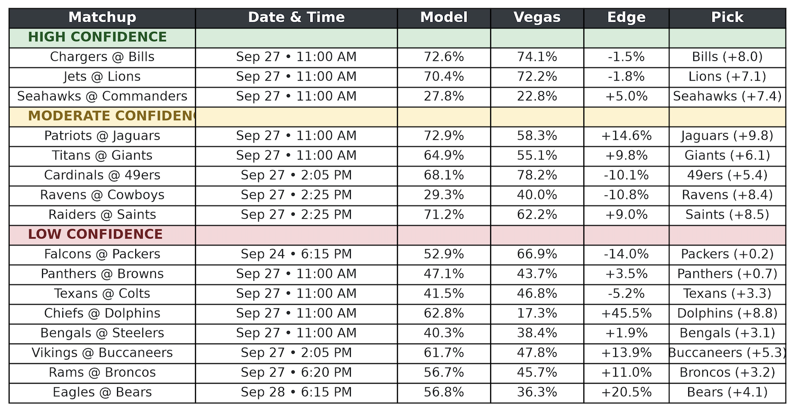

## Week 3 Results & Model Evaluation

The XGBoost predictive engine demonstrated strong calibration during the Week 3 slate, accurately identifying game winners in **75.0%** of high and moderate confidence matchups.

*Created: September 26, 2026 at 3:23 PM*

### 📊 Confidence Tier Breakdown

| Confidence Tier | Accuracy | Hit/Total | Highlights |
| :--- | :---: | :---: | :--- |
| **🟢 High** | 66.7% | 2/3 | Bills & Lions exact or near-exact margin hits[cite: 1, 2]. |
| **🟡 Moderate** | 80.0% | 4/5 | Strong performance forecasting wins for the Jaguars, Giants, 49ers, and Ravens[cite: 1, 2]. |

### 🎯 High & Moderate Matchup Performance

| Matchup | Tier | Projected Margin | Actual Result | Status |
| :--- | :---: | :---: | :--- | :---: |
| **Chargers @ Bills** | High | Bills by +8.0[cite: 2] | Bills won 24-16 (+8)[cite: 1] | ✅ |
| **Jets @ Lions** | High | Lions by +7.1[cite: 2] | Lions won 31-24 (+7)[cite: 1] | ✅ |
| **Seahawks @ Commanders** | High | Seahawks by +7.4[cite: 2] | Seahawks lost 31-33[cite: 1] | ❌ |
| **Patriots @ Jaguars** | Moderate | Jaguars by +9.8[cite: 2] | Jaguars won 35-6[cite: 1] | ✅ |
| **Titans @ Giants** | Moderate | Giants by +6.1[cite: 2] | Giants won 12-7 (+5)[cite: 1] | ✅ |
| **Cardinals @ 49ers** | Moderate | 49ers by +5.4[cite: 2] | 49ers won 36-30 (+6)[cite: 1] | ✅ |
| **Ravens @ Cowboys** | Moderate | Ravens by +8.4[cite: 2] | Ravens won 34-31[cite: 1] | ✅ |
| **Raiders @ Saints** | Moderate | Saints by +8.5[cite: 2] | Saints lost 27-35[cite: 1] | ❌ |

### 🔍 Margin Precision 

The engine's play-by-play data ingestion and weighting mechanisms generated highly precise point differentials for the top-tier predictions. The exact **8.0 point** margin hit for the Bills and the **0.1** differential for the Lions indicate the underlying feature engineering is effectively capturing team strength disparities. The drop-off in accuracy within the low-confidence tier suggests that these specific matchups contain higher variance, and further feature tuning may be required to improve the baseline predictions.