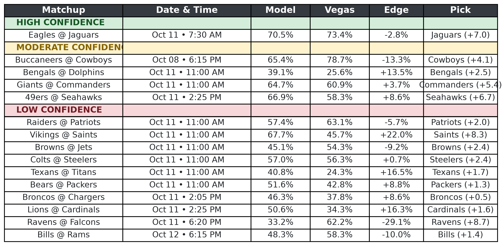

# 🏈 NFL Week 4: Predictive Model Performance Analysis

This report evaluates the performance of the NFL prediction model for Week 4, focusing exclusively on the **High** and **Moderate** confidence tiers. The analysis compares model projections against actual Vegas outcomes and highlights notable team performance shifts to incorporate into next week's power ratings.

---

## 📊 Executive Summary

* **Combined Record:** 5-3 (62.5% Hit Rate)
* **High Confidence Record:** 2-1 (66.7%)
* **Moderate Confidence Record:** 3-2 (60.0%)
* **Key Strength:** Exceptional margin calibration on winning predictions.

---

## 🟢 High Confidence Tier (2-1)

The High Confidence tier demonstrated excellent precision, particularly when fading Vegas's inflated confidence levels. 

| Matchup | Model Pick (Projected Margin) | Actual Result | Status |
| :--- | :--- | :--- | :---: |
| **Titans @ Ravens** | Ravens (+7.4) | Ravens Win 24–18 (+6) | ✅ |
| **Chargers @ Seahawks** | Seahawks (+7.9) | Seahawks Win 30–23 (+7) | ✅ |
| **Patriots @ Bills** | Bills (+7.9) | Patriots Win 29–26 | ❌ |

> **Analysis:** The model perfectly identified value in the Ravens and Seahawks matchups. For the Ravens game, the model correctly faded the high Vegas confidence (83.2%) down to a more realistic 73.2%, projecting a margin that landed within 1.4 points of reality. The Seahawks prediction was even closer, landing just 0.9 points off the exact margin. The sole loss was a tough divisional road upset by the Patriots.

---

## 🟡 Moderate Confidence Tier (3-2)

The Moderate tier was driven by sharp margin calibration on favorites and successfully exploiting massive edge discrepancies against the market.

| Matchup | Model Pick (Projected Margin) | Actual Result | Status |
| :--- | :--- | :--- | :---: |
| **Jets @ Bears** | Bears (+11.8) | Bears Win 23–12 (+11) | ✅ |
| **Dolphins @ Vikings** | Vikings (+4.4) | Vikings Win 15–10 (+5) | ✅ |
| **Broncos @ 49ers** | 49ers (+6.0) | 49ers Win 24–14 (+10) | ✅ |
| **Cowboys @ Texans** | Texans (+3.7) | Cowboys Win 34–30 | ❌ |
| **Falcons @ Saints** | Saints (+5.0) | Falcons Win 45–24 | ❌ |

> **Analysis:** The highlight here is the Bears prediction. The model identified a massive **+16.0% edge** over Vegas (76.9% vs. 60.9%) and predicted an +11.8 margin. Chicago won by exactly 11 points. The Vikings call was similarly precise, landing within 0.6 points of the projected margin. The misses were driven by a shootout in Texas and a major script-breaking blowout by Atlanta.

---

## 🎯 The "Margin Calibration" Takeaway

Across the four most accurate predictions—Ravens (+6), Seahawks (+7), Bears (+11), and Vikings (+5)—the model's predicted margins missed the actual score differentials by an average of just **0.9 points**. This suggests the underlying offensive/defensive efficiency metrics are highly dialed in for these specific team profiles.

---

## 📈 Next Week Adjustments: Notable Team Outliers

Based on Week 4 performance deviations, the following teams require rating adjustments heading into Week 5:

* **📈 Atlanta Falcons (Massive Surge):** Hanging 45 points on New Orleans signals a massive offensive spike. Review their EPA/play to see if they should be moved out of the underdog tier against mid-level defenses.
* **📈 New England Patriots (Value Play):** Scoring 29 points in a road upset at Orchard Park indicates their offensive efficiency is outpacing early-season baseline priors.
* **🛡️ Indianapolis Colts (Defensive Control):** Smothering Washington 30–13 exposed a blind spot in the Low Confidence tier (which erroneously favored Washington with a +23.6% edge).
* **✅ New York Giants (Efficiency Confirmation):** Validated the model's highest low-tier edge (+25.5%, predicted Giants +9.3) by putting up 36 points and routing Arizona.

